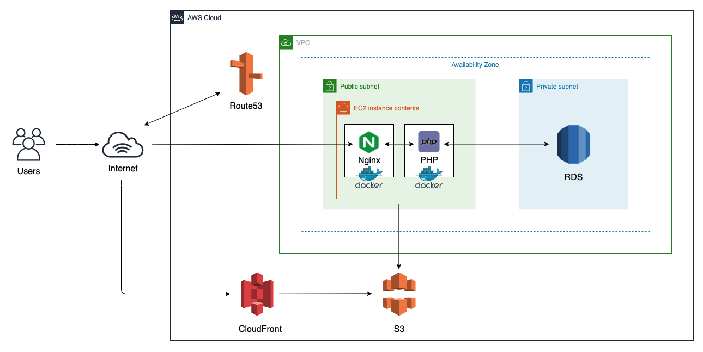

# Docchi

## 概要
世の中の対になっている2つのものをアンケートとして集計し、どちらの意見が多いかを比較するサービスです。
意見を聞きたい時や選択肢に迷った時に参考にしてもらうことを目的としています。
本アプリでは、1つ1つのアンケートをテーマと呼んでいます。

## URL
http://docchi.net 
トップページもしくはログインページのゲストログインボタンから、メールアドレスとパスワードの入力なしでかんたんにログインできます。
ゲストユーザーの場合、ユーザー情報の編集に一部制限がございます。

## 使用技術
フロントエンド 
・SCSS 1.20.1 
・Bootstrap 4.0.0 
・Vue.js 2.5.17 
 
バックエンド 
・PHP 7.4.3 
・Laravel 6.20.19 
 
開発環境 
・Git 
・Docker 
 
本番環境 
・Nginx 
・MySQL 
・AWS(VPC, EC2, RDS, S3, Route53, CloudFront) 
 
## 機能一覧
<ユーザー> 
ログイン/ログアウト 
ユーザー登録 
プロフィール編集 
パスワード編集 
パスワードリマインダー 
退会 
 
<テーマ> 
テーマ作成/編集/削除/回答 
ブックマーク 
コメント投稿 
並び替え(新着, 回答数, コメント数, ブックマーク数) 
ページネーション 
フリーワード検索 
タグ検索 
 
<その他> 
画像プレビュー 
お問い合わせ 
Google連携(ユーザー登録/ログイン) 
レスポンシブ対応 
 
## インフラ構成図

## ER図

